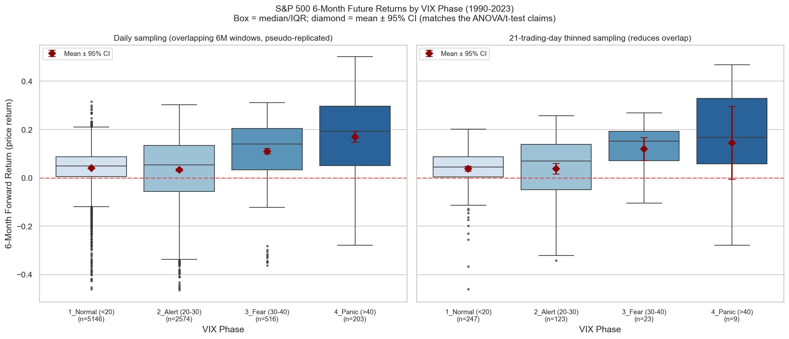
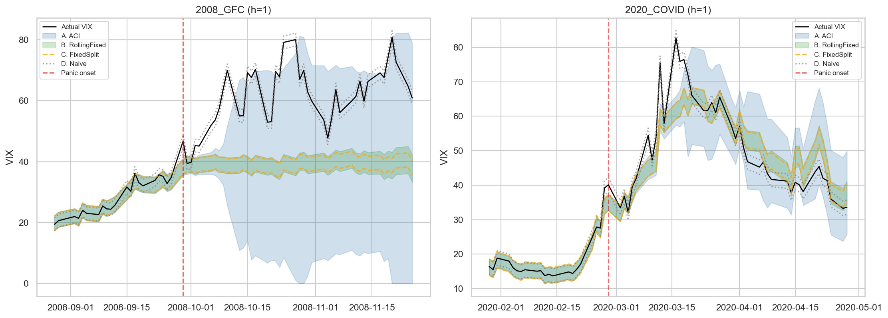
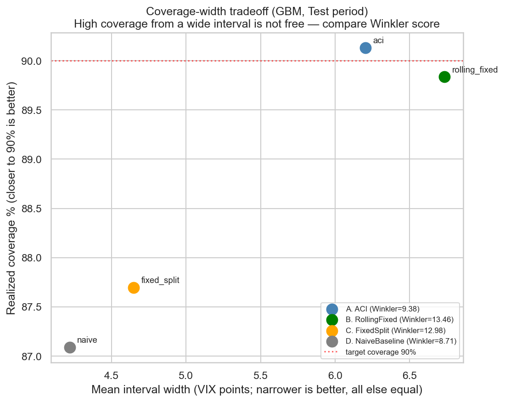

# VIXは何を予測できて、何を予測できないのか

**S&P500将来リターンの識別力の検証と、VIX将来値の時系列コンフォーマル予測**

---

## 3分でわかる要約

### 研究目的

**VIX（恐怖指数）の水準は、S&P500の将来リターンをどこまで識別できるのか。そしてその識別力は、統計的な前提を厳しく検証したあとも残るのか。**

「VIXが高いと、その後のリターンが高い」という経験則は投資の現場でよく語られる。本研究はその真偽を一度検定して終わらせず、次の4つの疑いを自分で立てて潰しにいく構成をとっている。

1. 検定の前提（等分散性・独立性）は成り立っているか
2. 観測された有意性は、重複するリターンによる自己相関の産物ではないか
3. 効果は少数の危機イベントに依存した見かけ上のものではないか
4. 統計的に有意であることと、経済的に意味があることは別ではないか

後半では視点を移す。前半の分析で、VIX水準による将来リターンの説明力が限定的であり（調整済みR²は1%未満）、日次重複による見かけの有意性も確認された。そこで**方向を当てる点予測ではなく、市場状態の不確実性を「区間」として評価する問題**へ進み、VIX自体の将来値に対する予測区間を時系列コンフォーマル予測で構築した。

### 使用データ

| 項目 | 内容 |
|---|---|
| データ | S&P500(^GSPC)、VIX(^VIX)、米10年国債利回り(^TNX) の日次終値 |
| 期間 | 1990-01-02 〜 2023-12-29（8,565営業日） |
| 出典 | Yahoo Finance（yfinance 1.5.1）、2026-09-08取得のスナップショットを同梱 |
| 目的変数 | 前半: S&P500の126営業日先リターン / 後半: h営業日先のVIX水準 |

### 最も重要な発見

**前半（VIXフェーズと将来リターン）**

1. VIXフェーズ間で6ヶ月先リターンの平均に、日次データ上は極めて強い統計的有意差がある（ANOVA F=182.6579、p<1e-100）。
2. **しかしこの有意性は大幅に割り引く必要がある。** 6ヶ月リターンを日次にスライドさせているため隣接観測が重複し、残差のDurbin-Watson統計量は **0.0323**（独立なら2.0付近）。観測間隔を四半期以上に広げると有意差は検出できなくなり、HAC補正後はVIX_Zも5%水準で有意でなくなる（6通りのラグ幅すべてで非有意）。
3. Panic群(VIX>40)の効果は、2008年と2020年の2イベントだけの産物ではない。独立した**9個の危機エピソード**にまたがり、そのうち**8個**でNormal群の平均を上回った（エピソード単位の符号検定 p=0.0391）。ただしn=9は小標本であり、これは強い証拠ではない。
4. **経済的な予測力はほとんどない。** 回帰モデルの調整済みR²は**0.55%**。Panic局面でも6ヶ月後リターンの最小値は-27.9%。

**後半（VIX将来値の予測区間）**

5. **より柔軟な勾配ブースティング(GBM)が、単純なランダムウォーク・線形回帰に一貫して負けた。** 点予測MAE（h=1）は persistence 1.079 / linear 1.078 に対し **GBM 1.369**。h=21でも同じ順序。
6. **適応型(ACI)の効果は実在するが、それは「αの適応」による部分が大きい。** ローリング窓だけ更新して α を固定した手法(B)と比べても、ACI(A)はWinkler scoreで有意に優れた（GBM: 差 −4.080、95%CI [−7.976, −1.411]）。一方、窓の更新だけの効果(B vs C)はWinklerでは**明確な差が確認できなかった**。
7. **ただしACIが常に勝つわけではない。** 点予測が弱いGBMを使うと、ACIはモデルを使わない素朴な区間(D)にWinklerで**有意に負ける**（差 +0.668、95%CI [+0.116, +1.352]）。h=21ではほぼ全ての手法差が統計的に区別できなかった。

### 統計的有意性と実用性は違う

日次データでのp値は1e-100を下回るが、**同じモデルの説明力は1%未満**である。この研究の主眼は「VIXが効く」ことの証明ではなく、**強い有意性の大部分が標本設計に由来する見かけであることを示す**点にある。VIXフェーズを売買シグナルとして使うことは、本研究の結果からは支持されない。

### コンフォーマル予測の主要結果（h=1、GBM、Test期間 N=5,421）

| 手法 | カバレッジ（目標90%） | 平均区間幅 | Winkler score |
|---|---:|---:|---:|
| A. ACI（ローリング窓＋適応α） | **90.13%** | 6.202 | 9.376 |
| B. RollingFixed（ローリング窓＋固定α） | 89.84% | 6.733 | 13.457 |
| C. FixedSplit（較正期間で固定、以後更新なし） | 87.70% | 4.649 | 12.982 |
| D. NaiveBaseline（モデルなし、固定） | 87.09% | 4.220 | **8.709** |

カバレッジだけを見るとACIが最良に見えるが、**区間幅を同時に評価するWinkler scoreではDが最良**。区間を広げればカバレッジは上がるため、カバレッジ単独で手法を評価してはならない。

### 危機直後の限界（最も重要な実務的示唆）

**どの手法も、危機発生直後には目標カバレッジを大きく下回る。**

| 手法 | Panic突入前21営業日の平均カバレッジ | 突入後21営業日 |
|---|---:|---:|
| A. ACI | 74.1% | **63.3%** |
| B. RollingFixed | 81.0% | 54.4% |
| C. FixedSplit | 76.9% | 38.8% |
| D. Naive | 77.6% | 43.5% |

ACIは他手法より劣化が小さいが、それでも目標90%には遠く届かない（2008年GFC直後は7/21=33.3%）。**ACIは危機を事前に予測する手法ではなく、外れたあとに数営業日かけて区間を広げる手法**である。

### この研究から言えること

- VIXフェーズは、日次データ上でS&P500の6ヶ月先リターン分布を統計的に識別している。
- ただしその識別力は、重複リターンによる自己相関で大幅に過大評価されている。
- Panic局面の効果は特定の2危機だけに依存してはいない（9エピソード中8個で成立）。
- VIX将来値の予測区間において、αの適応（ACI）は固定αより効率的な区間を作る（h=1）。
- 危機直後は、適応型を含むどの手法もカバレッジ保証が崩れる。

### この研究から言えないこと

- 「VIXが高いときに買えば儲かる」とは言えない（説明力1%未満、下方リスク-27.9%、34年で9回のみ）。
- 「ACIは常に優れる」とは言えない（h=21ではほぼ全ての差が統計的に区別不能、GBM併用時はnaiveに負ける）。
- 「複雑なモデルが良い」とは言えない（GBMは単純モデルに一貫して敗北）。ただし**チューニング不足の可能性は排除できない**。
- 因果関係については何も主張していない。
- 米国市場・1990〜2023年以外への一般化は検証していない。

### 再現方法

```bash
pip install -r requirements.txt
python vix_analysis.py              # 前半＋h=1のコンフォーマル予測（オフライン、同梱スナップショット使用）
python conformal_vix_forecast.py    # h=21とブートストラップ、全図の生成
python build_key_results.py         # docs/key_results.md を再生成
python -m pytest tests/ -v          # 24件のテスト（外部API接続なし）
```

既定では同梱のスナップショット（`data/vix_sp500_tnx_raw.csv`、2026-09-08取得）を読み込むため、**ネットワークなしで本READMEの数値が再現できる**。最新データで再取得する場合のみ `--source online` を指定する。

### AI利用の概要

初期分析、重複リターンによる自己相関への着眼、HAC標準誤差での再検証、コンフォーマル予測へ進む意思決定は本人が行った。その後の**コード監査・再構築・テスト整備・文書化にはClaude Codeを使用している**。詳細は「AI利用について」節を参照。

---

## 詳細ドキュメント

| ファイル | 内容 |
|---|---|
| [docs/key_results.md](docs/key_results.md) | **全数値表（`data/results_*.json` から自動生成）** |
| [docs/detailed_report.md](docs/detailed_report.md) | 手法の詳細、検定の前提の検証、解釈と限界の議論 |

READMEの数値と結果ファイルの一致は `tests/test_repo.py::test_readme_key_numbers_match_results` が検査する。

---

## 分析の流れ

```
[前半] VIXフェーズ → S&P500の6ヶ月先リターン
  1. 4段階のVIXフェーズ間で平均リターンに差があるか（ANOVA/Welch/Kruskal-Wallis）
  2. その有意性は重複リターンの自己相関によるものではないか（DW・間引き・検出力）
  3. HAC補正しても残るか（ラグ幅6通りの感度分析）
  4. 少数の危機イベントに依存していないか（leave-one-crisis-out + エピソード単位推論）
  5. 経済的に意味があるか（R²・下方リスク・シグナル頻度）
        ↓
   説明力は1%未満。方向の予測は困難と判断。
        ↓
[後半] VIX自体の将来値 → 予測区間（不確実性の定量化へ問題を変更）
  6. 4手法を同一条件で比較し、「αの適応」と「窓の更新」の効果を分離
     さらに手法差にブロックブートストラップで95%信頼区間を付ける
```

---

## 先行研究との関係

本研究は先行研究のレビューから出発したものではなく、「VIXが高い局面では将来リターンが高く見えるが、それは本当か」という素朴な問いを自力で検証する形で進めた。そのため既存研究との間に明確なギャップがある。**このギャップは本研究の限界であると同時に、次に進むべき方向でもある。**

### 説明変数の定義

本研究はVIXの**水準**（およびその63営業日ローリングZスコア）を説明変数としている。しかし分散リスクプレミアム（variance risk premium）の研究では、理論的に動機づけられた量は水準そのものではなく、**リスク中立測度の下での期待分散と、物理測度の下での期待分散の差**であるとされる。

VIX²はリスク中立測度の下での期待分散に対応するため、実現分散の予測値を差し引いた差分が、投資家が分散リスクを引き受ける対価として要求するプレミアムにあたる。本研究の設計はこの差分を取っていないため、物理測度側の変動が説明変数に混入した粗い近似になっている。回帰モデルの調整済みR²が0.55%に留まった一因はここにある可能性がある。

代表的な文献として Bollerslev, Tauchen & Zhou (2009), *Expected Stock Returns and Variance Risk Premia*, Review of Financial Studies 22(11) がある。同論文は、Epstein-Zin型選好とボラティリティのボラティリティ（vol-of-vol）を組み込んだ均衡モデルから分散リスクプレミアムを導出し、その予測力を実証している。

### 予測ホライズンの選択

本研究は126営業日（約6ヶ月）を予測ホライズンとしたが、これは理論や先行研究から導いたものではなく、探索的に採用した固定値である（「限界」節に記載の通り、感度分析も未実施）。分散リスクプレミアムの文献では、予測力がホライズンに対して単調ではなく特定の区間で最大化される形状が報告されている。ホライズンを振って予測力の形状そのものを確認する設計にすれば、この選択は恣意的なものではなくなる。

### 重複リターンの扱い

本研究が独自に問題視した「重複する多期間リターンによる自己相関がp値を過大評価する」という論点は、長期ホライズンの予測回帰を扱う文献では中心的な論点として長く議論されてきたものである。本研究ではNewey-West型HAC標準誤差とブロックブートストラップで対処したが、この文脈では Hodrick (1992) 型の標準誤差が用いられることも多く、有限標本での性質の比較は本研究では行っていない。

### 本研究の位置づけ

以上より、本研究は分散リスクプレミアム研究の**簡略版を、独立に再発見しながら実装したもの**と位置づけられる。理論的な導出を持たず説明変数も近似であるため、既存研究に対する新規性を主張するものではない。一方で、標準的な検定で得られる強い有意性が標本設計に由来して過大評価されうることを、自分のデータで定量的に示した点には教育的な価値があると考えている。

次の拡張方向としては、(1) 実現分散の予測を組み込んだ分散リスクプレミアムの構成、(2) ホライズンを振った予測力の形状の確認、(3) 構造モデル（確率ボラティリティモデルやHAR-RV等）による点予測と、本研究で実装したコンフォーマル予測による区間構成の組み合わせ、が考えられる。

> **注**: 本節は研究の位置づけを示すためのものであり、体系的な文献レビューではない。引用した文献の具体的な数値や結論の詳細については原典を参照されたい。

---

## 主要な図

### VIXフェーズ別の6ヶ月先リターン



日次サンプル（左）と21営業日間引きサンプル（右）。**間引くとPanic群のn=203がn=9になり、信頼区間が大きく広がる**。箱は中央値/IQR、赤い菱形は平均±95%CI（検定は平均の議論なので併記した）。

### 危機局面での4手法の挙動



2008年GFC・2020年COVIDの突入前後。較正期間で固定した区間（C: オレンジ点線、D: グレー点線）はVIXの急騰に取り残される。ACI（水色）とRollingFixed（緑）は追随するが、**いずれも数営業日の遅れを伴う**。

### カバレッジと区間幅のトレードオフ



縦軸がカバレッジ、横軸が平均区間幅。**右上（広くて当たる）は良い手法とは限らない**ことを示すため、各点にWinkler scoreを併記している。

---

## 限界と実務的解釈

### 主要な限界

- **重複観測**: 日次でスライドさせた6ヶ月リターンは本質的に重複しており、N=8,439は独立情報量ではない。実効的な独立標本数は9（エピソード数）と203（Panic日数）の間のどこかにある。
- **検出力不足**: 間引き後の標本（Semiannual, N=67）は検出力28%しかなく、「非有意」を「効果なし」と読んではならない。
- **エピソード単位推論の弱さ**: 符号検定のn=9は極めて小さい。日次検定（過大評価）と符号検定（保守的）の間に真の不確実性がある。**本研究はどちらか一方を「正しい有意性」として採用しない。**
- **価格リターン**: ^GSPCは価格指数であり、配当を含まない。トータルリターンより低く見積もられている（定量化は未実施）。
- **事後選択**: VIX閾値20/30/40は市場で慣行的に用いられる区切りを採用したが、63営業日のエピソード分離基準、h=1/h=21、252営業日の再学習間隔、ラグ1/5/10/21/63は**探索的に採用した固定値であり、感度分析は実施していない**。分析前に決めたか途中で決めたかの記録は残っていない。
- **ハイパーパラメータ未調整**: GBMの`max_depth=4, max_iter=200`、ACIの`γ=0.01`、較正窓500日は計算時間を抑えるため事前に固定した。**評価期間は一切参照していない**が、チューニング不足の可能性は排除できない。
- **h=1のVIX水準予測は課題として易しい**: persistenceのMAEが1.079という水準では、モデルによる改善余地が小さい。この土俵での「GBMの敗北」は、複雑なモデル一般の否定ではない。
- **FixedSplitは極端な設定**: 較正期間（2000-2002年）の分位点を21年間更新しない設定であり、実務的な非適応手法の代表ではない。この比較でACIが優れて見える分を割り引く必要がある。
- **単一市場・単一期間**: 米国市場・1990〜2023年に限定。
- **多重比較**: リポジトリ全体で数十件の検定を行っており、単一の補正は適用していない（後述）。

### 実務的解釈

- **VIXフェーズ単体を売買シグナルとして使うべきではない。** 説明力1%未満、Panic局面でも6ヶ月後-27.9%の観測があり、34年で9エピソードしかシグナルが出ない。
- **リスク管理の補助指標としては一定の価値がある。** フェーズ分類自体は将来リターン分布の違いを識別している。ただし「識別できる」と「収益機会がある」は別問題。
- **予測区間を実務で使うなら、較正を更新しない固定区間だけに頼るのは危険。** FixedSplitはPanic局面でカバレッジ19.6%（36/184）まで崩れる。
- **ただし適応型でも危機直後は信頼できない。** ACIの危機後カバレッジは63.3%。**平時のリスク量に基づく区間は、急変時の最初の数週間は破れる前提で運用すべき**であり、コンフォーマル予測のカバレッジ保証を無条件の安全網として扱ってはならない。
- **複雑なモデルを入れる前に、単純なベースラインとの比較を必ず行うべき。** 本研究ではGBMが一貫して敗北した。

### 多重比較について

本リポジトリは検証的な仮説群（VIXフェーズ間の差の検定）と、探索的な補助分析（HACラグ感度、定常性検定、間引き、局面別集計など）を含む。**単一の機械的な補正は適用していない**。理由は、検定群の性格が異なり、一律補正が保守的すぎる／解釈不能になるためである。代わりに以下の方針をとった。

- 主要な仮説群（4フェーズのペアワイズ比較6組）にはHolm補正を適用した。
- **境界的なp値は確証的な結果として扱わない。** 具体的には次の2つは探索的結果と位置づける。
  - 間引きQuarterly-63dのKruskal-Wallis p=0.0450
  - Treasury_10Y 1日差分の HAC p=0.0499
  どちらも数十件の未補正検定の中で0.05をわずかに下回った値であり、**「有意」とは判断しない**。
- コンフォーマル予測の手法差には、p値ではなくブロックブートストラップによる95%信頼区間を用いた。

---

## リポジトリ構成

```
vix_research/
├── data_pipeline.py                    # 単一のデータ取得・特徴量生成（スナップショット既定）
├── vix_analysis.py                     # 通し実行スクリプト（前半＋h=1コンフォーマル）
├── analysis_01_phase_tests.py          # ANOVA/Welch/Kruskal/Levene/Bartlett/間引き
├── analysis_02_leave_one_crisis_out.py # 危機エピソード検出・LOCO・エピソード単位推論
├── analysis_03_hac_power.py            # HACラグ感度・検出力分析（効果量はJSONから読込）
├── analysis_04_stationarity_economic.py# 定常性検定・経済的有意性
├── analysis_05_figure.py               # フェーズ別リターンの可視化
├── conformal_vix_forecast.py           # 4手法の比較・ACI・ブロックブートストラップ
├── build_key_results.py                # docs/key_results.md を自動生成
├── tests/test_repo.py                  # 24件のテスト（外部API接続なし）
├── requirements.txt / setup.cfg / .gitignore
├── data/
│   ├── vix_sp500_tnx_raw.csv           # 2026-09-08取得のスナップショット（既定のデータソース）
│   └── results_*.json                  # 各分析の出力（docs/key_results.md の生成元）
├── docs/
│   ├── key_results.md                  # 全数値表（自動生成）
│   └── detailed_report.md              # 手法と解釈の詳細
├── figures/
│   ├── phase_returns_daily_vs_thinned.png
│   ├── phase_returns_overview.png
│   ├── conformal_aci_overview.png
│   ├── conformal_crisis_zoom.png
│   ├── conformal_efficiency.png
│   └── vix_analysis_2008_zoom.png
└── archived/                           # 本研究と無関係な別実験（未使用）
```

### 目的別の実行方法

| 目的 | コマンド |
|---|---|
| 前半の全数値 + h=1のコンフォーマル予測 | `python vix_analysis.py` |
| h=21・ブートストラップ・全図 | `python conformal_vix_forecast.py` |
| 個別の章だけ再確認 | `python analysis_0X_*.py` |
| 数値表の再生成 | `python build_key_results.py` |
| 検証 | `python -m pytest tests/ -v` |

全スクリプトは `data_pipeline.build_dataset()` のみをデータソースとし、既定でスナップショットを読む。したがって実行順序に依存せず、ネットワークなしで再現できる。`--source online` を明示した場合のみ yfinance から再取得する（Yahoo Finance側の改定により数値が変わる可能性がある）。

---

## AI利用について

本リポジトリは、生成AI（Claude Code）を用いた改修を含む。透明性のため、担当範囲を明示する。

**本人が行ったこと**

- 初期のノートブックによる分析（ANOVA・Tukey・OLS・HAC）
- 重複する将来リターンによる自己相関という問題への着眼
- HAC標準誤差を用いた再検証への到達
- 時系列コンフォーマル予測へ展開する意思決定と、手法（ACI）の選択
- 評価方針の決定、実行結果の確認、結果の解釈、限界の判断、公開判断
- AIの提案に対する検証と否定（例: 「Panic群は2008年と2020年の2イベントに依存しているのでは」という指摘を、エピソード分解によって実際に検証し、支持されないことを確認した）

**Claude Codeが行ったこと**

- コード監査と、それに基づく全面的な再構築
- `data_pipeline.py` / `analysis_01〜05.py` / `conformal_vix_forecast.py` / `vix_analysis.py` / `build_key_results.py` の作成
- ACI・ブロックブートストラップ・4手法比較の実装
- テストスイート（24件）の作成
- README・詳細ドキュメントの構成と執筆

生成されたコードを本人がすべて手書きしたわけではない。一方で、**何を検証するか、どの結果を信じるか、どこまで主張するかの判断は本人が行っている**。

---

## 注意事項

本分析は過去データに基づく統計的検証であり、将来の投資成果を保証するものではない。投資判断に用いる場合は、他の市場環境・リスク管理手法・ポートフォリオ全体の状況を考慮する必要がある。
